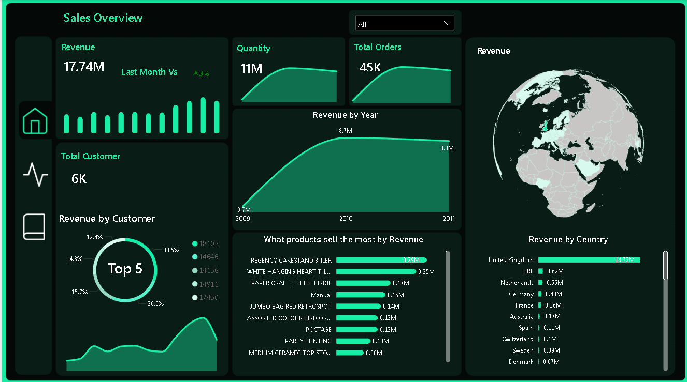
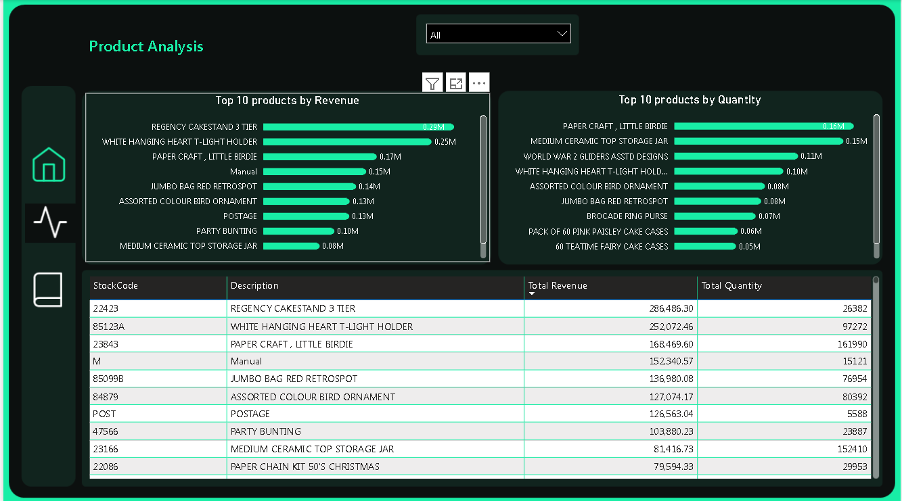
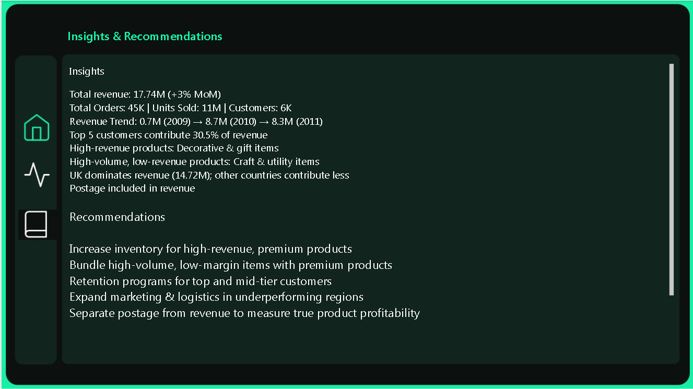

# E-Commerce Sales Dashboard | Internship Task 1

## Overview
This project was completed as part of my **Data Analysis & Science internship**.  
The goal was to analyze multi-year e-commerce sales data and build an **interactive Power BI dashboard** to help business owners make **data-driven decisions**.

The dashboard answers key business questions:
- Which products generate the highest revenue?  
- When do sales peak throughout the year?  
- Which regions contribute most to revenue?  
- How can business operations be optimized for profitability and growth?

---

## Dataset
The dataset includes **transactions from 2009–2011** with the following columns:

`Invoice | StockCode | Description | Quantity | InvoiceDate | Price | Customer ID | Country`

**Data Preparation Steps:**
- Combined multiple yearly datasets into a single table  
- Removed null values in `Description` and `Customer ID`  
- Converted negative quantities to positive values  
- Handled zero prices  
- Created a **Calendar table** for time-based analysis  
- Ensured clean relationships between tables for accurate reporting

---

## Key Findings

| Area | Finding |
|------|---------|
| Overall Revenue | Total revenue reached **17.74M**, showing **+3% month-over-month growth**. |
| Orders & Units | **45K orders**, **11M units sold**, serving **6K customers**, indicating strong demand. |
| Revenue Trend | Revenue grew from **0.7M (2009)** → **8.7M (2010)** → **8.3M (2011)**; growth stabilized after 2010. |
| Customer Contribution | Top 5 customers contribute **~30.5% of total revenue**, showing high revenue dependency. |
| Product Performance | High-revenue products are **decorative & gift-oriented**; some craft/utility items sell high volumes but low revenue. |
| Product Strategies | Premium/high-margin products drive revenue; low-margin/high-volume products drive traffic. |
| Geographic Insights | **UK dominates revenue (14.72M)**; other countries contribute significantly less. |
| Revenue Accuracy | Postage included in revenue slightly inflates product-level revenue. |

---

## Dashboard Pages

### 1️⃣ Sales Overview
- **KPIs:** Total Revenue, Total Orders, Total Quantity Sold, Total Customers  
- **Line Chart:** Monthly revenue trend  
- **Bar Chart:** Revenue by Country  
- **Slicer:** Year

- 

**Insights:** Revenue grew sharply from 2009 to 2010, then slightly declined in 2011. Steady month-over-month growth indicates consistent demand.

---

### 2️⃣ Best-Selling Products
- **Top 10 Products by Revenue**  
- **Top 10 Products by Quantity Sold**  
- **Product Details Table** (Description, StockCode, Revenue, Quantity)
- **Slicer:** Year

**Insights:** High-revenue products are decorative & gift-oriented; high-volume products are craft & utility items. Two distinct product strategies exist: premium/high-margin vs. volume-driven.

---

### 3️⃣ Insights & Recommendations
**Insights:**
- Total revenue: 17.74M (+3% MoM)  
- 45K orders, 11M units, 6K customers  
- Revenue trend: 0.7M → 8.7M → 8.3M  
- Top 5 customers contribute ~30.5% of revenue  
- High-revenue products: Decorative & gift-oriented  
- High-volume, low-revenue products: Craft & utility items  
- UK dominates revenue (14.72M); other countries contribute less  
- Postage included in revenue inflates product figures  

**Recommendations:**
- Increase inventory for high-revenue, premium products  
- Bundle high-volume, low-margin items with premium products  
- Implement retention programs for top and mid-tier customers  
- Expand marketing & logistics in underperforming regions  
- Separate postage from revenue to measure true product profitability  

